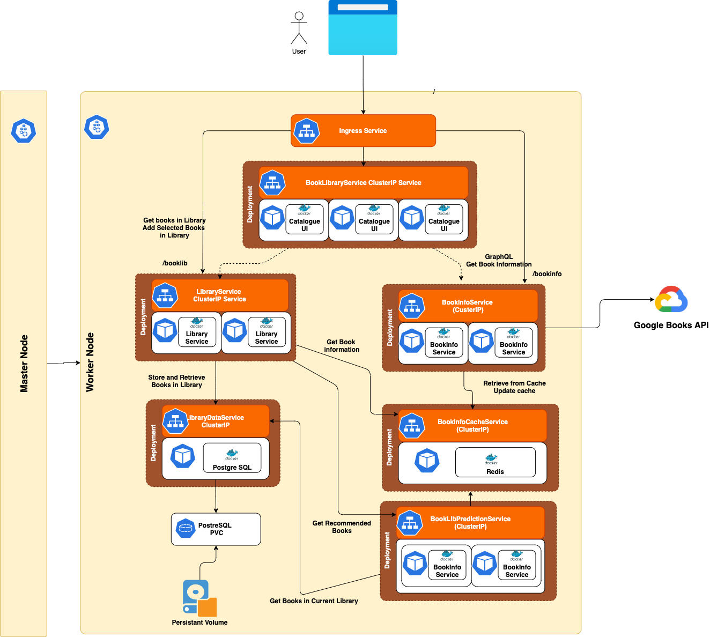

# Reference Implementation for "Supercharge your Applications with GraalVM" Book
This is a reference implementation to demostrate GraalVM based Microservices architecture. Its a very simple Book catalogue, powered by Google Books API. The following the application architecture.

You can check out the book at these links
* https://www.packtpub.com/product/supercharge-your-applications-with-graalvm/9781800564909
* https://www.amazon.com/Supercharge-Your-Applications-GraalVM-hands/dp/1800564902
* https://www.waterstones.com/book/supercharge-your-applications-with-graalvm/a-b-vijay-kumar//9781800564909
 

* **Catalogue UI Service**: This web page is the home page, where the user lands after successfully logging in. (We will not be implementing the login, authentication and authorization in MVP). This web page presents way to search and view the books. This will be implemented as a Micro-Front end (Refer to https://micro-frontends.org/ for more details on Micro-frontends). We will have 3 UI components as follows:
  1. **Book List UI Component**: List of all the books
  2. **Book Details UI Component**: This component shows all the detailed information about the selected book.
  3. **Prediction UI component**: This shows the books that are predicted, based on the books in the library.
* **Library UI Service**: This lists the books in personal library and allows the user to add or delete books from this library.
Now to support these UI services, we will need Microservices that store, fetch and search the books. The following are the services that we will need
* **Catalogue Service**: These services provide the RESTful APIs to browse, search and view the book details. 
* **Prediction Service**: To demonstrate the polyglot feature of GraalVM, let us assume that we already have a machine learning code, that we have developed using Python, which can predict the book, based on the books that are available in the library. We will embed this Python code in this Java microservice to demonstrate, how GraalVM can help us build optimized embedding polyglot applications.
* **Library Service**: This service will provide all the restful API to access books in the library, add and delete them from the Library. 
* **Book Info Service**: Lets decide to use Google Books API (https://developers.google.com/books) to get all the details about the books. We will need a Service that proxies the Google Books API. This will help us manage the data that is coming from Google Books API. This also provides a proxy layer, so that we can always switch to a different Book API service, without changing the whole application. 
